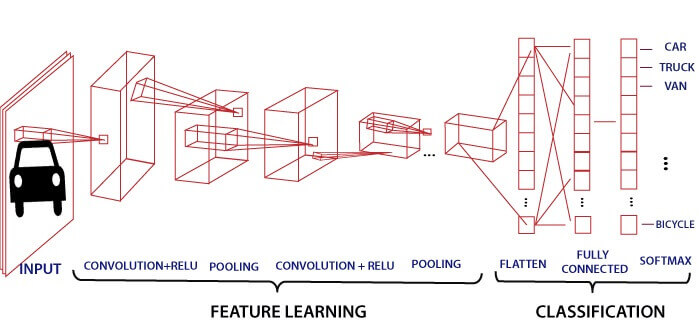

# Convolutional Neural Networks from scratch for image classification

In this repository, you can find Convolutional Neural Networks written in numpy from scratch (no framework involved) that trains by mini-batches.
In the related notebook, we'll use a pre-trained model to recognize and classify images of handwritten digits.




## Getting Started   

To run it You need jupyter notebook installed or You can run it using [google colab](https://colab.research.google.com).

The main file is [Convolutional Neural Networks.ipynb]([Convolutional Neural Networks.ipynb]) 

### Prerequisites
```
-numpy
-matplotlib
-pandas
-scipy
-pickle
-random
```

## Author

* [Sohaib1424](https://github.com/Sohaib1424)
